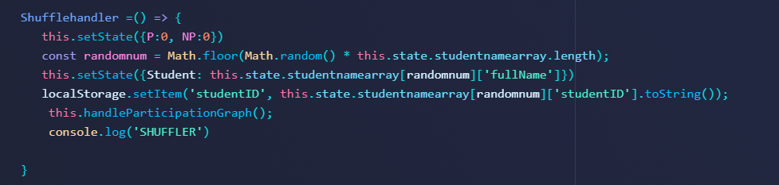
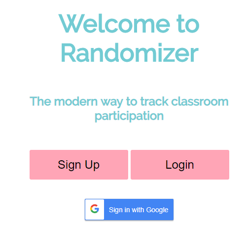

I'm feeling a lot better this week. I believe that I may have been getting burned out by the constant hours put into the project. This week was preceded by a week long break observing the Thanksgiving holiday. It was a relief.

During this week, I had a [whiteboard](https://youtu.be/QsxG40AEq5I) challenge. I also had a lot of work completed in the features. [1](https://github.com/Lambda-School-Labs/Labs8-Randomizer/pull/58)
[2](https://github.com/Lambda-School-Labs/Labs8-Randomizer/pull/57) [3](https://github.com/Lambda-School-Labs/Labs8-Randomizer/pull/50) [4](https://github.com/Lambda-School-Labs/Labs8-Randomizer/pull/46)

This week did not go without it's problems. There were some problems getting things working because of the many components we had. I feel if there was better planning, the logic would have been simpler to achieve.

Here's a snippet of our code to pick a random student from a list of objects

As you can see, there are multiple setstates. We got caught up by this because setState is not instant, so multiple setstates can slow a program.

I also had some trouble styling with a package I installed. I fixed this problem by installing a much newer version. I now have oauth added. 
