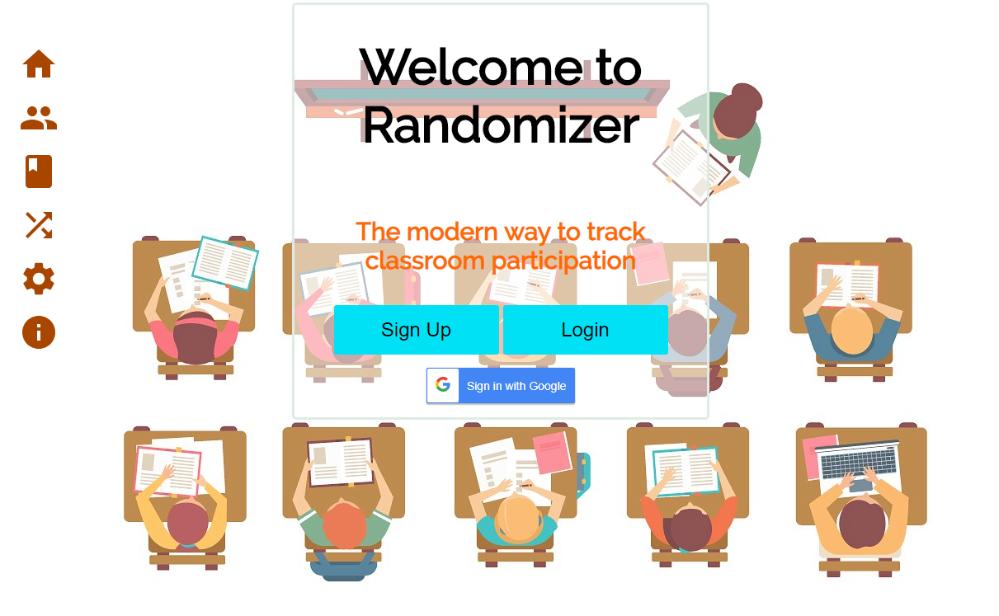

This week gave me mixed feelings. The goal set on my group seemed simple but it actually was filled
with some unexpected difficulties. Our goal was "Student should be able to work with a team to deliver a product that looks, feels, and operates like a professionally developed product". Easy enough, right?
Refactoring our ui and getting things functional was a huge challenge. There were constant merge issues, and one was incorrectly fixed so the app didn't render in our continuous deployment.  
Overall we did get a nice ui 
I didn't get to add much code this week because of the big changes that were being handled with each push. Here's a [push](https://github.com/Lambda-School-Labs/Labs8-Randomizer/pull/83) I made that deleted some unused components and added some ui elements. I didn't merge it though because it was a big change and because there was a db issue.
This experience is helping me learn what to avoid when working in a more professional environment. 
